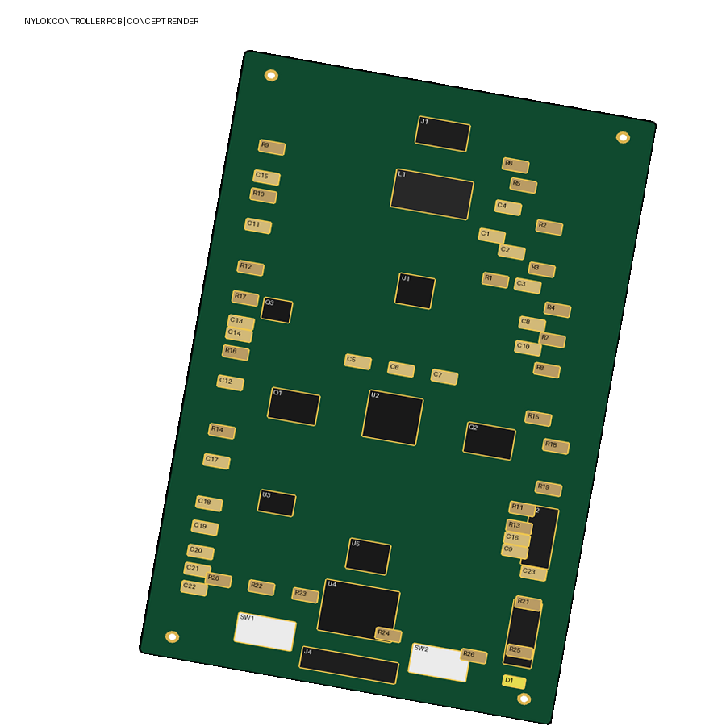

# Nylok Handheld Induction Heater Controller


A KiCad reconstruction of a two-mode handheld induction-heater controller concept, prepared for the Notre Dame / Marmon / Nylok Innovate-a-thon.



> [!CAUTION]
> **Concept only. Do not fabricate or energize this board.** This preliminary design has not completed electrical review and is not approved for fabrication.

## Overview

The concept uses two protected 18650 cells in series to power a controller board that:

- measures input current;
- provides regulated 5 V and 3.3 V rails;
- controls a switched DC output for an **external ZVS induction driver**;
- exposes an I2C display connector; and
- provides an SWD programming header for the STM32 controller.

The work coil connects to the external ZVS driver, not directly to connector J2 or the battery.

## Current maturity

| Area | Status |
|---|---|
| System concept and sizing study | Documented |
| Logical net map and BOM | Draft |
| Schematic capture | Legacy conceptual reconstruction |
| PCB placement/routing | Visual concept |
| Firmware | Not included |
| Prototype testing | Not performed |
| Fabrication release | **Not approved** |

## Repository contents

```text
.
├── hardware/   KiCad project, schematic, PCB, BOM, and logical net map
├── docs/       Engineering study and connection diagram
├── fab/        Fabrication-readiness notes (not production outputs)
├── renders/    Board concept views
└── scripts/    Repository package checks
```

Key files:

- [`hardware/Nylok_Heater.kicad_pro`](hardware/Nylok_Heater.kicad_pro): KiCad project
- [`hardware/Nylok_Heater.sch`](hardware/Nylok_Heater.sch): legacy KiCad schematic
- [`hardware/Nylok_Heater.kicad_pcb`](hardware/Nylok_Heater.kicad_pcb): nominal 38 mm × 100 mm, two-layer PCB concept
- [`hardware/BOM.csv`](hardware/BOM.csv): draft component/value list
- [`hardware/NETS.csv`](hardware/NETS.csv): logical net map
- [`docs/Nylok_Labeled_PCB_and_Connections.png`](docs/Nylok_Labeled_PCB_and_Connections.png): labeled placement and connection diagram
- [`docs/Induction_System_Specification.md`](docs/Induction_System_Specification.md): research, assumptions, calculations, and primary sources

## Open the project

1. Install KiCad 10 or later.
2. Clone the repository:

   ```bash
   git clone https://github.com/3nboyd/Nylok-Heater.git
   cd Nylok-Heater
   ```

3. Open `hardware/Nylok_Heater.kicad_pro`.
4. Allow KiCad to convert the legacy `.sch` file if prompted, but review the resulting diff before committing it.
5. Read [`docs/Induction_System_Specification.md`](docs/Induction_System_Specification.md) before using the design data.

To check the repository package itself:

```bash
python3 scripts/validate_repo.py
```

This script checks file presence, project metadata, BOM/net structure, PCB references, and PNG integrity. It does **not** certify electrical correctness, safety, or fabrication readiness.

## Safety

Induction heating combines high current, resonant switching, strong local heating, rechargeable cells, and potentially hazardous workpiece temperatures. A short circuit, unsuitable component, control fault, inadequate insulation, or incorrect battery protection can cause burns, fire, cell venting, or equipment damage.

Do not build or energize this concept until a qualified engineer has reviewed the power stage, protection, thermal behavior, creepage/clearance, component ratings, coil/tank behavior, enclosure, battery system, and failure modes. Use current-limited isolated laboratory power during early development and appropriate PPE, guarding, instrumentation, and fire precautions.

## Contributing

Improvements are welcome. Please read [`CONTRIBUTING.md`](CONTRIBUTING.md) before opening an issue or pull request. Do not mark the design fabrication-ready without appropriate engineering review and test evidence.

## License

No open-source license has been selected. The repository is public for review and collaboration, but publication alone does not grant permission to copy, modify, manufacture, or redistribute the design. The owner can add an OSI/OSHWA-compatible license later after choosing the intended terms.
